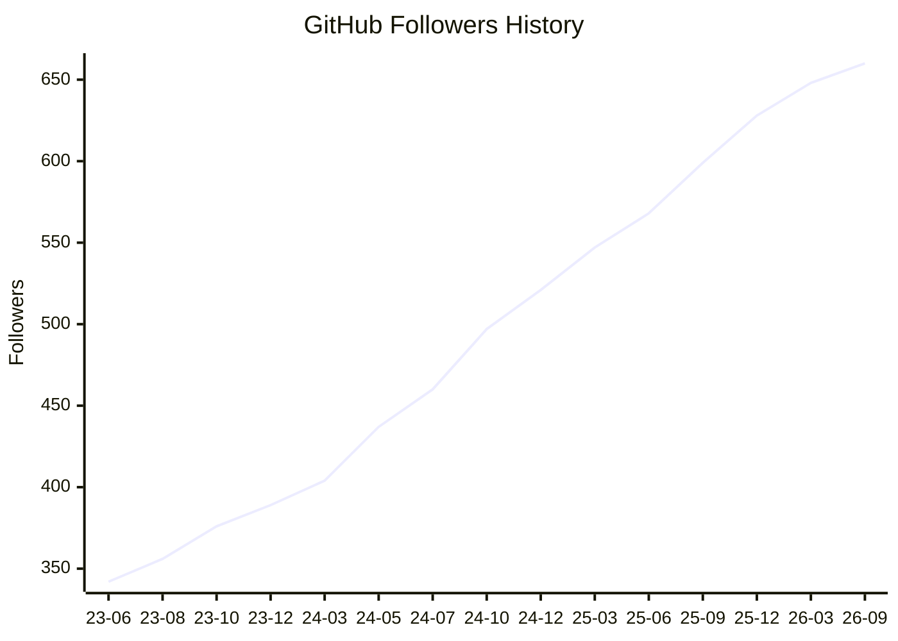

## yutkat

<p align="left">
  <a href="https://github.com/antonkomarev/github-profile-views-counter"></a>
  <a href="https://github.com/yutkat?tab=followers"></a>
  <a href="https://github.com/yutkat?tab=repositories&sort=stargazers"></a>
</p>
<p align="left">
  <a href="https://gitstar-ranking.com/yutkat"></a>
  <a href="https://user-badge.committers.top/japan/yutkat"></a>
  <a href="https://github.com/gayanvoice/top-github-users/blob/main/markdown/followers/japan.md"></a>
</p>

<p align="left">
  <a href="https://markdown.new/https://x.com/yutkat"></a>
  <a href="https://markdown.new/https://x.com/yutkat"></a>
  <a href="https://bsky.app/profile/yutkat.github.io"></a>
  <a href="https://bsky.app/profile/yutkat.github.io"></a>
  <a href="https://www.reddit.com/user/yutkat"></a>
  <a href="https://stackoverflow.com/users/5720201/yutkat"></a>
</p>

<p align="left">
  <a href="https://zenn.dev/yutakatay"></a>
  <a href="https://zenn.dev/yutakatay"></a>
  <a href="https://zenn.dev/yutakatay"></a>
  <a href="https://qiita.com/yutkat"></a>
  <a href="https://qiita.com/yutkat"></a>
</p>

<p align="left">
  <a href="https://yutkat.github.io/"></a>
  <a href="https://x.com/yutkat"></a>
  <a href="https://zenn.dev/yutakatay"></a>
  <a href="https://qiita.com/yutkat"></a>
  <a href="https://dev.to/yutkat" target="blank"></a>
  <a href="https://stackoverflow.com/users/yutkat" target="blank"></a>
  <a href="https://www.quora.com/profile/Yutkat" target="blank"></a>
  <a href="https://ossinsight.io/analyze/yutkat" target="blank"></a>
</p>

### Development Environment

<!-- markdownlint-capture -->
<!-- markdownlint-disable -->
<!--START_SECTION:github_profile_bio-->
| | |
|---:|:---|
| **Role** | Programmer |
| **Editor** | Neovim |
| **Shell** | zsh |
| **Terminal** | WezTerm |
| **OS** | NixOS, ArchLinux(Hyprland), Android |
| **PC** | Thinkpad, Lemur Pro, HHKB Hybrid , GameBall |
<!--END_SECTION:github_profile_bio-->
<!-- markdownlint-restore -->

### Recent Activities

<p align="left">
  <!-- <a href="https://github.com/anuraghazra/github-readme-stats"></a> -->
  <a href="https://github.com/vn7n24fzkq/github-profile-summary-cards"></a>
  <a href="https://github.com/DenverCoder1/github-readme-streak-stats"></a>
</p>

[](https://github.com/vn7n24fzkq/github-profile-summary-cards)
<a href="https://github.com/Ashutosh00710/github-readme-activity-graph">
<picture>
<source media="(prefers-color-scheme: dark)" srcset="https://github-readme-activity-graph.vercel.app/graph?username=yutkat&custom_title=Contribution%20Graph%20in%20the%20last%2031%20days&hide_border=true&theme=github-dark-dimmed" />

</picture>
</a>

### Languages

[](https://github.com/vn7n24fzkq/github-profile-summary-cards)
[](https://github.com/vn7n24fzkq/github-profile-summary-cards)
[](https://github.com/anuraghazra/github-readme-stats)

### OSS Insight

<!-- Copy-paste in your Readme.md file -->

<a href="https://next.ossinsight.io/widgets/official/compose-user-dashboard-stats?user_id=8683947" target="_blank" style="display: block" align="center">
  <picture>
    <source media="(prefers-color-scheme: dark)" srcset="https://next.ossinsight.io/widgets/official/compose-user-dashboard-stats/thumbnail.png?user_id=8683947&image_size=auto&color_scheme=dark" width="771" height="auto">
    
  </picture>
</a>

<!-- Made with [OSS Insight](https://ossinsight.io/) -->

<!-- Copy-paste in your Readme.md file -->

<a href="https://next.ossinsight.io/widgets/official/compose-currently-working-on?user_id=8683947&activity_type=all" target="_blank" style="display: block" align="center">
  <picture>
    <source media="(prefers-color-scheme: dark)" srcset="https://next.ossinsight.io/widgets/official/compose-currently-working-on/thumbnail.png?user_id=8683947&activity_type=all&image_size=auto&color_scheme=dark" width="497.5" height="auto">
    
  </picture>
</a>

<!-- Made with [OSS Insight](https://ossinsight.io/) -->
<!--
### Achievement

[](https://github.com/ryo-ma/github-profile-trophy)
-->

### Metrics

<details>
  <summary>GitHub Metrics</summary>

<!--  -->

[](https://github.com/lowlighter/metrics)

</details>

### Wakatime Analysis

<details>
  <summary>Other Statics</summary>

<!-- markdownlint-capture -->
<!-- markdownlint-disable -->
  <!--START_SECTION:waka-->


**🐱 My GitHub Data** 

> 📦 239.7 kB Used in GitHub's Storage 
 > 
> 🏆 1,978 Contributions in the Year 2026
 > 
> 🚫 Not Opted to Hire
 > 
> 📜 128 Public Repositories 
 > 
> 🔑 5 Private Repositories 
 > 
**I'm an Early 🐤** 

```text
🌞 Morning                11682 commits       ███████░░░░░░░░░░░░░░░░░░   26.20 % 
🌆 Daytime                15412 commits       █████████░░░░░░░░░░░░░░░░   34.57 % 
🌃 Evening                11360 commits       ██████░░░░░░░░░░░░░░░░░░░   25.48 % 
🌙 Night                  6132 commits        ███░░░░░░░░░░░░░░░░░░░░░░   13.75 % 
```
📅 **I'm Most Productive on Tuesday** 

```text
Monday                   7179 commits        ████░░░░░░░░░░░░░░░░░░░░░   16.10 % 
Tuesday                  7407 commits        ████░░░░░░░░░░░░░░░░░░░░░   16.61 % 
Wednesday                7180 commits        ████░░░░░░░░░░░░░░░░░░░░░   16.10 % 
Thursday                 7158 commits        ████░░░░░░░░░░░░░░░░░░░░░   16.05 % 
Friday                   6632 commits        ████░░░░░░░░░░░░░░░░░░░░░   14.87 % 
Saturday                 4237 commits        ██░░░░░░░░░░░░░░░░░░░░░░░   09.50 % 
Sunday                   4793 commits        ███░░░░░░░░░░░░░░░░░░░░░░   10.75 % 
```


📊 **This Week I Spent My Time On** 

```text
🕑︎ Time Zone: Asia/Tokyo

💬 Programming Languages: 
Other                    38 hrs 20 mins      █████████████████████░░░░   82.12 % 
Markdown                 2 hrs 21 mins       █░░░░░░░░░░░░░░░░░░░░░░░░   05.06 % 
Bash                     1 hr 41 mins        █░░░░░░░░░░░░░░░░░░░░░░░░   03.64 % 
Git                      52 mins             ░░░░░░░░░░░░░░░░░░░░░░░░░   01.89 % 
Nix                      46 mins             ░░░░░░░░░░░░░░░░░░░░░░░░░   01.64 % 

🔥 Editors: 
Chrome                   41 hrs 58 mins      ██████████████████████░░░   89.90 % 
Claude Code              4 hrs 4 mins        ██░░░░░░░░░░░░░░░░░░░░░░░   08.73 % 
Neovim                   25 mins             ░░░░░░░░░░░░░░░░░░░░░░░░░   00.92 % 
Codex CLI                12 mins             ░░░░░░░░░░░░░░░░░░░░░░░░░   00.46 % 

💻 Operating System: 
Linux                    46 hrs 41 mins      █████████████████████████   100.00 % 
```

🤖 **AI Coding This Week** 

```text
⏱ AI Coding Time: 4 hrs 38 mins (9.95%)

✍️ 991 lines written by AI, 7 lines written by hand (99.3% AI-written)

🔤 3,032,984 Input Tokens, 629,269 Output Tokens

💵 $53.95 Estimated AI Cost This Week

🧠 21 AI Sessions, 199 AI Prompts

Opus                     1,037 lines         █████████████████████████   100.00 % 
GPT                      0 lines             ░░░░░░░░░░░░░░░░░░░░░░░░░   00.00 % 

🔎 AI Coding Insights:
🤖 AI-Driven — 99.3% of written lines came from AI
📄 Detailed Prompter — average 702 characters per prompt
🔁 Iterative Prompter — average 9 prompts per session
🚀 High AI Trust — 6.91% of changed lines were hand-edited
```

**I Mostly Code in Lua** 

```text
Lua                      25 repos            ███████████░░░░░░░░░░░░░░   44.64 % 
Shell                    10 repos            ████░░░░░░░░░░░░░░░░░░░░░   17.86 % 
Python                   6 repos             ███░░░░░░░░░░░░░░░░░░░░░░   10.71 % 
TypeScript               4 repos             ██░░░░░░░░░░░░░░░░░░░░░░░   07.14 % 
Nix                      1 repo              ░░░░░░░░░░░░░░░░░░░░░░░░░   01.79 % 
```


**Timeline**


 Last Updated on 09/10/2026 23:37:00 UTC
<!--END_SECTION:waka-->
<!-- markdownlint-restore -->
</details>

### GitHub Follower History

<!-- markdownlint-capture -->
<!-- markdownlint-disable -->
<!--START_SECTION:github_follower_history-->

<!--END_SECTION:github_follower_history-->
<!-- markdownlint-restore -->

### This page status

[](https://u8views.com/github/yutkat)

[](https://github.com/yutkat/yutkat/actions/workflows/main.yml)
